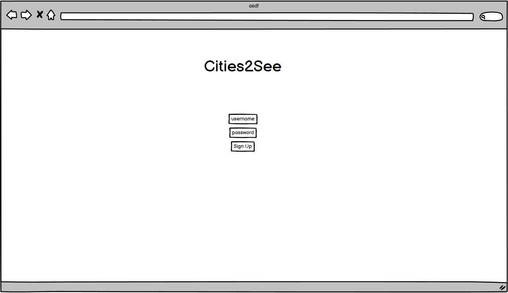
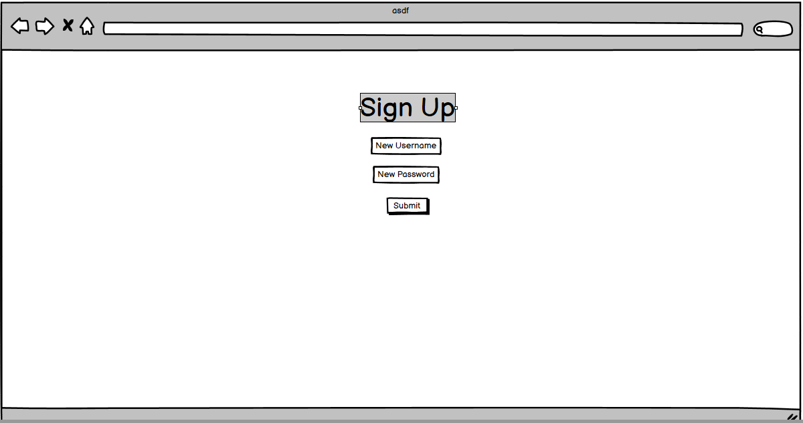
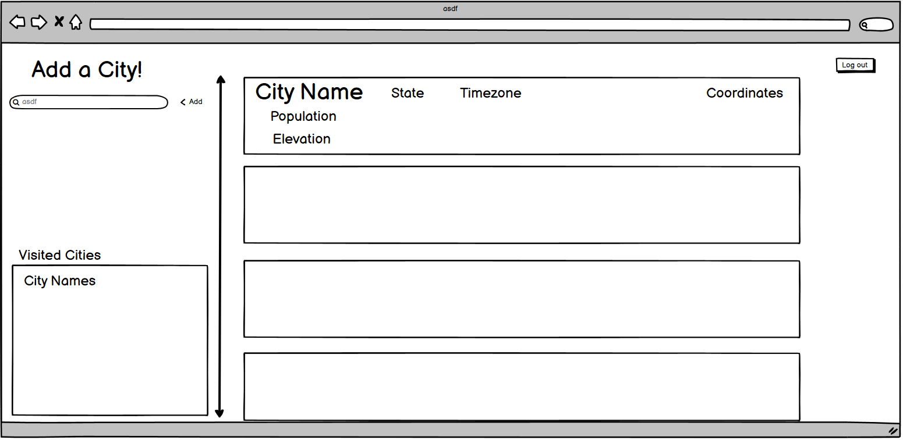

# Cities2See

## Table of Contents

* Description 
* User Story
* Wireframe
* API
* Rough breakdown of tasks

---

## Description

A web application to keep track of the cities that you want to visit. The user can search up a city and the city details will save to their profile. The user can delete cities with a click of a button. 

---

## User Story

```
AS A USER
I WANT to create an account and login to my dashboard
SO THAT I can start searching for cities
I WANT to search for a city
SO THAT I can save that city to my account
I WANT to see my saved cities
SO THAT I can visit them later
I WANT to delete my saved cities
SO THAT I can clear cities I have already visited or don't want
```

---

## Wireframe





---


## API

[GeoDB Cities API](https://rapidapi.com/wirefreethought/api/geodb-cities)

---

## Rough breakdown of tasks

* Chris- Create User and Search models. Stylize handlebars with Materialize.
* Paola - Polish routes and API calls and their associated back-end and front-end files.
* Ricky - Start homeRoutes and assist team.
* Payne - Start login/logout javascript and add delete routes and functions for cards. Stylize Prezi presentation.
* Chris, Payne, Ricky - Research APIs.